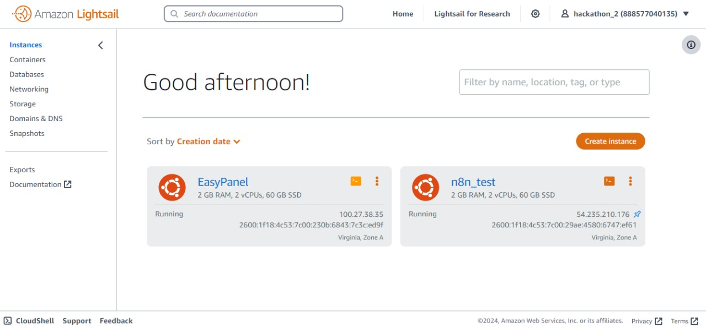

# Stark-Tools

## Descrição do projeto

A solução Stark Tools foi desenvolvida pensando em resolver a dificuldade de uso de ferramentas de gestão de capital por pessoas não técnicas, especialmente para pequenos empreendedores que não possuem uma estrutura administrativa financeira especializada. Nós atingimos esse objetivo através de uma calculadora financeira integrada ao WhatsApp que funciona por comandos de voz.
  

Para desenvolver a calculadora, o grupo criou agentes de inteligência artificial generativa do modelo GPT via API da OpenAI. Utilizamos o framework Langchain para treinar os LLMs, N8N para integração do backend com APIs, Docker para subir a integração com a nuvem da AWS, API da Evolution para integrar a solução com o WhatsApp e EasyPanel para o controle e monitoramento do banco de dados.

Para ter acesso ao chat, o usuário precisa de um número de WhatsApp para se conectar com o bot, sem instalações adicionais. Depois disso, basta ele enviar os áudios com as informações que deseja obter. A seguir estão descritas as funcionalidades da calculadora: 

 

- **Pagamento:** Utilize sua calculadora financeira para organizar os pagamentos futuros do seu negócio. Insira todas as despesas fixas e variáveis, como aluguel, serviços públicos, fornecedores e outras obrigações mensais. Para cada despesa, registre a data de vencimento e o valor devido. Use a função de adição para somar o total de pagamentos programados para cada mês e a função de subtração para ajustar qualquer pagamento antecipado ou desconto recebido. Esta organização permitirá um controle eficaz de seu fluxo de caixa e evitará atrasos em pagamentos. 

- **Recebimento:** Com sua calculadora financeira, organize os recebimentos esperados do seu negócio. Insira todas as fontes de receita, como vendas, serviços prestados e qualquer outro tipo de entrada de dinheiro, com suas respectivas datas de recebimento. Utilize a função de adição para calcular o total de recebimentos para cada período (diário, semanal ou mensal). Dessa forma, você poderá planejar melhor o uso de seus recursos e assegurar que terá caixa suficiente para cobrir as despesas futuras. 

- **Summarização** (soma) Entradas 

- **Summarização** (soma) Saídas 

## Autores
- Davi Versan
- Lucas Pontes
- Débora Queiroz
- Pedro Cavalcante
- Denilson Torres

## Observações
A solução Stark Tools foi desenvolvida durante o Hackathon AI Revolution promovido pelo Stark Bank nos dias 30/08/2024 a 01/09/2024. O repositório contendo o projeto ficará disponível de forma open source com as devidas atribuições feitas aos autores mencionados nesse documento.

## Documentação e Referências
[API Evolution](https://github.com/EvolutionAPI/evolution-api)

[Docker](https://hub.docker.com/r/atendai/evolution-api/tags)

[Amazon Web Services](https://aws.amazon.com/pt/documentation-overview/?nc2=h_ql_doc_do)

[API Evolution do projeto](https://evolution-evolutionativado.txh56x.easypanel.host/)

[Panel API Evolution](http://evolution-evolutionativado.txh56x.easypanel.host/manager)

Easy Panel:

